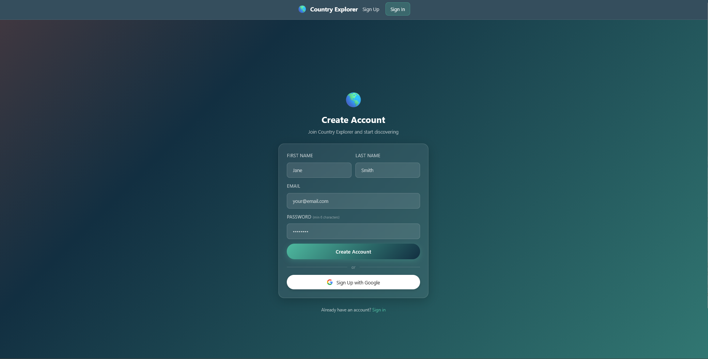
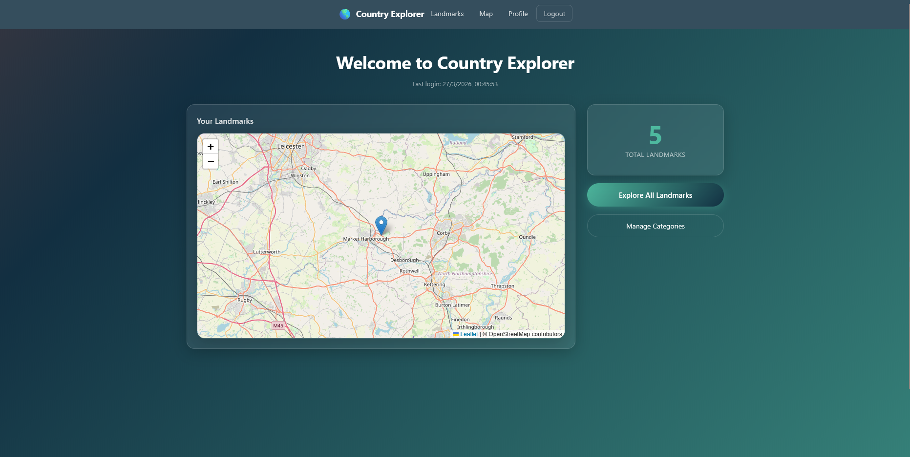
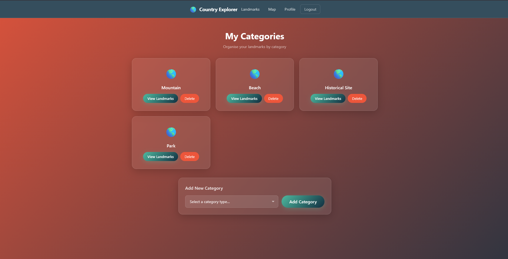
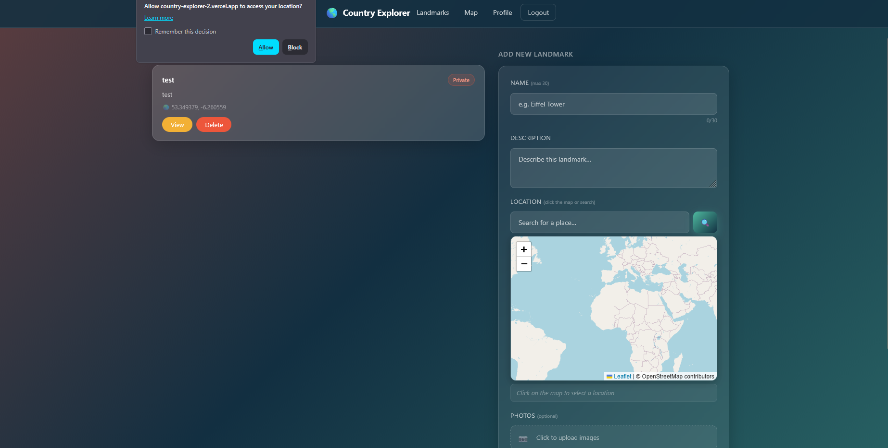
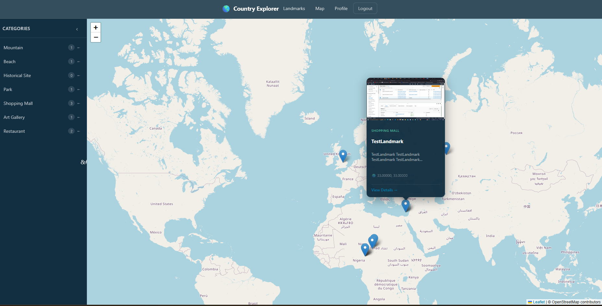
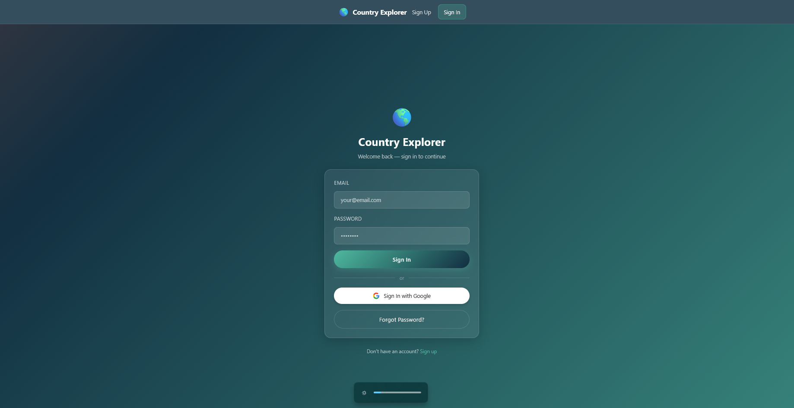

# Country Explorer 2

A web application built with Svelte and Firebase that lets users explore, save, and share locations around the world. Users can mark places on an interactive map, upload photos, write descriptions, and check real-time weather conditions — all within a secure, authenticated experience.

**Live Demo:** [country-explorer-2.vercel.app](https://country-explorer-2.vercel.app/)

---

## Screenshots

<p align="center">
  
  
</p>
<p align="center">
  
  
</p>
<p align="center">
  
  
</p>
<p align="center">
  
  
</p>
> Adjust the filenames above to match the actual image files in your `projectPresentationPhotos/svelte-appnpx/` folder.

---

## Features

- **User Authentication** — Sign up and sign in securely with Google via Firebase Auth
- **Interactive Maps** — Explore landmarks on a Leaflet map, click to add new locations, drag markers to adjust
- **Photo Gallery** — Upload multiple images per landmark with lazy-loaded, responsive gallery views
- **Real-Time Data** — Firebase Realtime Database keeps everything synced across sessions
- **Weather Info** — Check live weather conditions for any saved location using the OpenWeatherMap API
- **Data Visualisation** — Admin dashboard with Chart.js graphs showing login activity and device stats
- **Privacy Controls** — Mark landmarks as public or private
- **Responsive Design** — Glassmorphism UI with animated gradient backgrounds, works on mobile and desktop

---

## Tech Stack

| Technology | Purpose |
|---|---|
| **Svelte** | Frontend framework for reactive, component-based UI |
| **Firebase** | Authentication, Realtime Database, and Cloud Storage |
| **Leaflet** | Interactive maps with marker placement and geocoding |
| **Chart.js** | Data visualisation for the admin dashboard |
| **OpenWeatherMap API** | Live weather data for saved locations |
| **Rollup** | Module bundler for building the production app |
| **Vercel** | Hosting and deployment |

---

## Getting Started

### Prerequisites

- [Node.js](https://nodejs.org/) (v18 or higher recommended)
- A [Firebase project](https://console.firebase.google.com/) with Authentication, Realtime Database, and Storage enabled
- An [OpenWeatherMap API key](https://openweathermap.org/api)

### Installation

```bash
git clone https://github.com/AndrianBarbulat/Country_Explorer_2.git
cd Country_Explorer_2/svelte-appnpx
npm install
```

### Environment Variables

Create a `.env` file in the `svelte-appnpx` directory:

```env
FIREBASE_API_KEY=your_api_key
FIREBASE_AUTH_DOMAIN=your_project.firebaseapp.com
FIREBASE_DATABASE_URL=https://your_project.firebaseio.com
FIREBASE_PROJECT_ID=your_project_id
FIREBASE_STORAGE_BUCKET=your_project.appspot.com
FIREBASE_MESSAGING_SENDER_ID=your_sender_id
FIREBASE_APP_ID=your_app_id
FIREBASE_MEASUREMENT_ID=your_measurement_id
OPENWEATHER_API_KEY=your_openweather_key
```

### Running Locally

```bash
npm run dev
```

Opens the app at `http://localhost:8080` with live reloading.

### Building for Production

```bash
npm run build
npm run start
```

---

## Deployment

The app is deployed on [Vercel](https://vercel.com). On every push to `main`, Vercel automatically builds and deploys.

Environment variables are configured in the Vercel dashboard under **Settings → Environment Variables** using the same keys listed above.

Firebase authorised domains must include your Vercel URL for Google Sign-In to work in production.

---

## Project Structure

```
svelte-appnpx/
├── public/              # Static assets and built output
├── src/
│   ├── controllers/     # Business logic layer
│   ├── models/          # Firebase data models
│   ├── services/        # Firebase config and service setup
│   ├── stores/          # Svelte writable stores (auth, state)
│   ├── styles/          # Shared CSS files
│   ├── views/           # Svelte page components
│   │   └── assets/      # Reusable UI components (Navbar, Footer, Sidebar)
│   └── main.js          # App entry point
├── .env.example         # Environment variable template
├── rollup.config.js     # Rollup build configuration
└── package.json
```

---

## Author

Andrian Barbulat

---

## License

This project is developed for educational purposes as part of a university assignment.